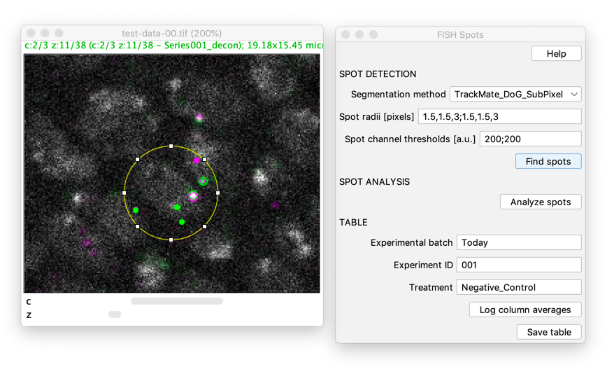

# Analyse FISH Spots - Fiji Plugin

A Fiji plugin to analyse images with FISH spots.

DNA FISH makes it possible to detect specific genomic loci and estimate their number and distance at a resolution of a single nucleus by hybridization of fluorescent probes that share sequence similarity with a genomic region of interest. Important applications involve counting specific loci that differences in their number is associated with disease such as cancer. In addition, the genome is architecturally organized inside the nucleus and in certain cases different regions that are distant in the linear genome, need to come in proximity so as to perform genome function. In that sense, DNA FISH can actually be used to measure distances between the regions of interest. However, identifying the spot center as well as calculating the distance between spots is a laborious and not trivial task. 
"Analyse FISH Spots" simplifies and semi-automates this process.

## Installation

- Please [install Fiji](fiji.sc)
    - Note that in case of doubt starting from a fresh Fiji is recommended 
- Start Fiji and [add the update site](https://imagej.net/update-sites/following): DNA-FISH
- Restart fiji and the plugin will appear under **[ Plugins > Analyze > FISH Spots ]** 

Notes: 

1. a previous version of this plugin was distributed as a jar with a name similar to **open-stacks-as-virtual-stacks.jar**. This jar may be in your Fiji plugins or jars folder and **must be removed**.
2. another previous version of this plugin was distributed via the **EMBL-CBA** update site; this is deprecated and this update site **must not be used anymore**.

## Usage

1. Open Fiji with the DNA FISH update site installed
2. Open your DNA FISH image
3. [ Plugins > Analyze > FISH Spots ]

### Channel setup

Select which channels contain DNA FISH spots, if a channel does contain some other signal, please select "Nuclei". 

Currently, the "Nuclei" channel is not used for anything. In future versions of the plugin it could be interesting to also support segmentation of the nuclei to make sure that only spots within one nucleus are related to each other. Please [write an issue](https://github.com/embl-cba/DNA-FISH/issues) if you are interested in this feature.

### Background assignment

Outline regions that contain unspecific intra-nuclear background signal.

The mean intensity in those regions, in the respective channel, is used for background subtraction during the center of mass computation for the location of spots. 

### Find spots

Spots are detected using TrackMate; details can be [found here](https://imagej.net/TrackMate_Algorithms#Spot_features_generated_by_the_spot_detectors).

Please adapt the spot radii and channel thresholds until all spots are detected without detecting (too many) false positive spots. You can always change the parameters and click [ Find spots ] again to redo the spot detection. 

Note that you could tolerate to have a few false positive spots when they are far enough away from the actual spots of interest, because you will manually select interest points close to which you will analyse spots. Thus, if a real spot in each channel is closer to the interest point than any false positive spot, the false positive spots will not be taken into account for the analysis.

You can restrict the spot detection by placing a ROI on the image before clicking [ Find spots ]. Note that this will only restrict the spot detection in 2D. There currently is no way to restrict along the z-axis.

### Analyze spots

##### Select spot regions of interest 

The aim of this plugin is to measure spot distances in different channels. To tell the algorithm where in the image to measure those distances use ImageJ's multi-point selection tool mark the regions in which FISH spots should be analyzed (see below). 

The logic here is that the algorithm will compute pair-wise distances between the spots in all channels that are **closest** to the selected point.

For example, in the below screenshot the manually placed cross informs the algorithm that it should measure the distances between the two spots in the center of the image, because they are the two the spots that are closest to the cross. 

It is *not important* to place these points very exactly, because the algorithm will just use these annotations to identify the regions in which it should measure the FISH spot distances. 

In general the idea is to place many positions in the image and only then click [ Analyze spots ], as this will trigger the batch analysis of the spots in all the selected regions.

However, care must be taken that really the spots of interest are the two closest to the selected region. For example, one could imagine that a spot at the border of a nucleus is closer to a spot in the neighboring nucleus than to the corresponding spot in the same nucleus. There are two approaches to handle this:

1. place the cross not on the spot that is close the edge of the nucleus, but rather between the two spots that belong to each other
2. during the spot detection (s.a.) draw a ROI around the nucleus of interest as this will then only detect the spots in this nucleus

##### Perform and QC distance measurements 

Upon pressing the **[ Analyze spots ]** button, the plugin will, for each of the manually selected points, find the *closest* spot in each channel, measure its position and measure the distances between the spots in the different channels. 

This will result in a table where each row corresponds to one selected region. Clicking on the table row will highlight all FISH spots that were used for the corresponding distance measurements and thus allow you to visually QC the analysis.

The table will contain the following columns:

TODO

## Further information

### TrackMate_DoG

Given d an approximate expected particle diameter, determined upon inspection, two gaussian filters are produced with standard deviation σ₁ and σ₂:

σ₁ = 1 / (1 + √2 ) × d

σ₂ = √2 × σ₁

The image is filtered using these two gaussians, and the result of the second filter (largest sigma) is subtracted from the result of the first filter (smallest sigma). This yields a smoothed image with sharp local maximas at particle locations. A detection spot is then created for each of these maximas, and an arbitrary quality feature is assigned to the new spot by taking the smoothed image value at the maximum. If two spots are found to be closer than the expected radius d/2, the one with the lowest quality is discarded.

#### TrackMate_DoG_SubPixel

To improve the localization accuracy, and extra step is taken to yield a sub-pixel localization of the spots. The position of each spot is recalculated using a simple parabolic interpolation scheme, as in {David G. Lowe, "Distinctive image features from scale-invariant keypoints", International Journal of Computer Vision, 60, 2 (2004), pp. 91-110.}.

